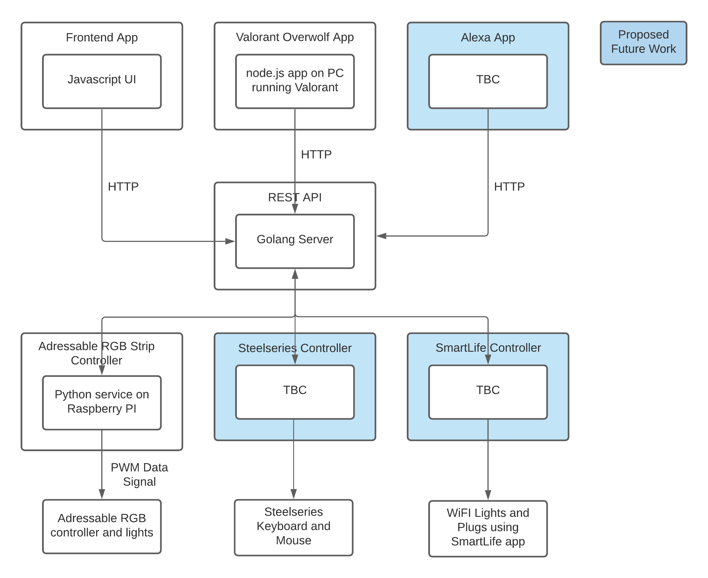

# Light Controller

Light controller is a project aimed at integrating a variety of different lights and devices with lights via bespoke and 
third party controllers together, and providing a range of different applications to control them.

### Proposed System Architecture
